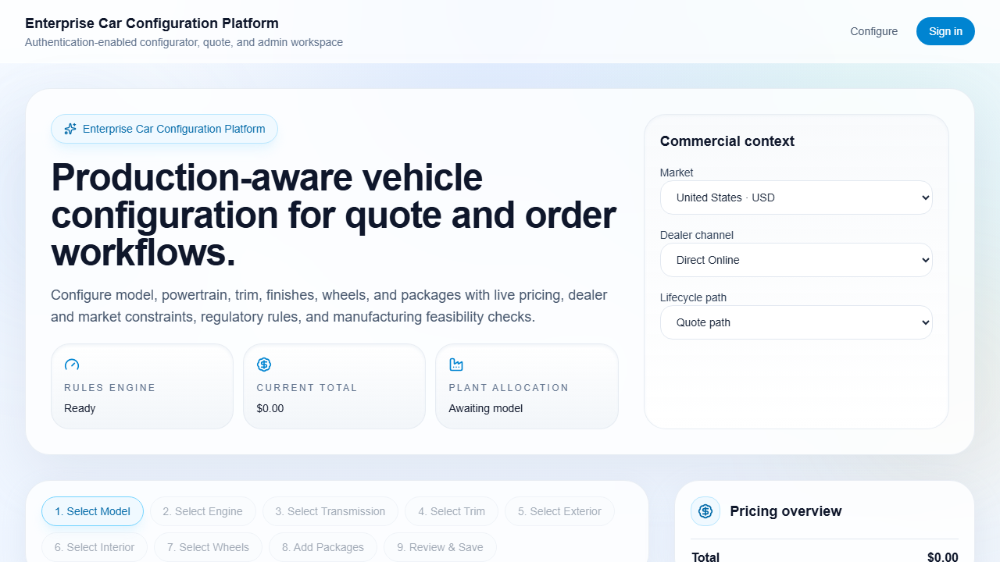
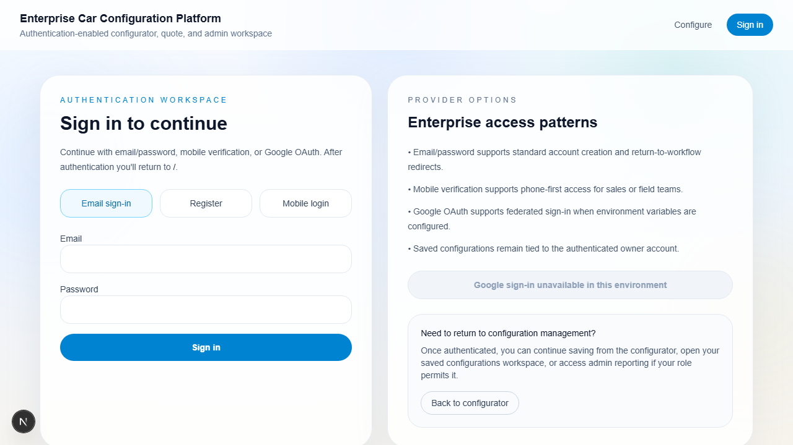
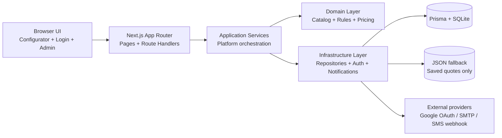

# Enterprise Car Configuration Platform (ECP)

Production-ready full-stack enterprise vehicle configurator built with Next.js 16, React 19, TypeScript, Prisma, and Playwright. The platform demonstrates rules-driven product configuration, authentication and role-based access control, saved-configuration management, admin oversight, and polished end-user UX in a single portfolio-ready repository.


## Why this repo stands out

- Complete full-stack ECP application in `ecp-platform/`
- Rules-driven vehicle configuration, pricing, compliance, and manufacturing validation
- Authentication with email/password, Google OAuth, and phone login flows
- User-owned saved configurations plus admin-only oversight tools
- Prisma + SQLite persistence with JSON fallback for quote storage resilience
- Unit, integration, UI, and browser automation coverage
- Repository-level delivery docs, setup guides, and prompt archive

## Screenshots

### Premium configurator landing experience



### Dedicated authentication flow with return-to support



## Demo

### Suggested walkthrough

1. Open the configurator and select a vehicle such as `Atlas SUV`
2. Move through powertrain, trim, color, interior, wheel, and package decisions
3. Review live pricing, compliance, and manufacturing feedback
4. Click **Save Quote** while signed out and confirm redirect to `/login`
5. Sign in with email/password, Google OAuth, or phone login to resume the save flow
6. Open `/saved-configurations` to update or delete your saved items
7. Open `/admin` with an allowlisted account to review users and cross-user saved configurations

### Run the demo locally

```bash
cd ecp-platform
npm install
cp .env.example .env
npm run db:push
npm run dev
```

Then visit `http://127.0.0.1:3000`.

## Feature table

| Area | Included capabilities |
| --- | --- |
| Configurator | Multi-step vehicle configuration, dealer/market-aware rules, pricing, incentives, and feasibility checks |
| Authentication | Email/password, Google OAuth, phone verification login, session cookies, and return-to redirects |
| Saved configurations | Auth-required save flow, draft preservation, user-owned list/detail/edit/delete flows |
| Authorization | User/admin role separation with protected `/saved-configurations` and `/admin` routes |
| Notifications | Save/update confirmation emails via SMTP or safe local JSON transport fallback |
| Quality | Vitest unit/integration/UI coverage plus Playwright smoke testing |

## Architecture diagram



## Core capabilities

- Multi-step configurator for model, engine, transmission, trim, exterior, interior, wheels, packages, and review/save
- Dealer and market-aware rule evaluation
- Quote path and order path lifecycle handling
- Live pricing, incentives, markups, compliance, and manufacturing feasibility output
- Email/password, Google OAuth, and phone-based sign-in flows
- Redirect-to-login save flow with return-to continuation and local draft preservation
- User-owned saved-configuration workspace with resume, update, and delete support
- Admin-only user/configuration oversight workspace
- Quote persistence, saved-configuration ownership, and recent quote retrieval

## Repository layout

- `ecp-platform/` - Next.js 16 application source
- `Requirement/` - original problem statement document
- `Prompts/` - AI prompt archive used to guide implementation
- `README.md` - repository overview
- `SETUP.md` - local setup and run instructions
- `USER_GUIDE.md` - end-user walkthrough
- `TESTING.md` - testing strategy and commands
- `ARCHITECTURE.md` - technical architecture overview

## Quick start

1. Change into the app directory: `cd ecp-platform`
2. Install dependencies: `npm install`
3. Create env file from example: `copy .env.example .env` on PowerShell or `cp .env.example .env`
4. Set `AUTH_ADMIN_EMAILS` in `.env` if you want your local account to open `/admin`
5. Prepare the local database: `npm run db:push`
6. Start the app: `npm run dev`
7. Open `http://127.0.0.1:3000`

## Key scripts

Run these from `ecp-platform/`:

- `npm run dev` - start local development server
- `npm run lint` - run ESLint
- `npm run test` - run all Vitest suites
- `npm run build` - production build validation
- `npm run test:e2e` - Playwright smoke test
- `npm run db:push` - create/update the SQLite schema

## Authentication and notifications

- Local email/password sign-in works with only the default `.env` plus a database
- Phone sign-in works locally by default with `PHONE_AUTH_DEV_MODE="true"`; the verification code is returned for development use
- Google OAuth is optional and becomes available when `GOOGLE_CLIENT_ID`, `GOOGLE_CLIENT_SECRET`, and `GOOGLE_REDIRECT_URI` are configured
- Save/update confirmation emails use SMTP when the `EMAIL_SERVER_*` settings are present; otherwise they fall back to a local JSON transport for safe development use
- Access to `/saved-configurations` requires login
- Access to `/admin` requires a user whose email or phone appears in `AUTH_ADMIN_EMAILS` or `AUTH_ADMIN_PHONES`

## Persistence behavior

- Primary store: Prisma + SQLite using `DATABASE_URL=file:./prisma/dev.db`
- Saved-configuration fallback store: `ecp-platform/data/saved-quotes.json`
- Authentication, provider linkage, phone verification, and session persistence are Prisma-backed

If Prisma is unavailable for saved-configuration reads/writes, the repository can fall back to the JSON store. Authentication itself still requires Prisma because session and account data are relational.

## Validation

Use the following commands from `ecp-platform/` for a full local verification pass:

- `npm run test`
- `npm run lint`
- `npm run build`
- `npm run test:e2e`

## Deployment

### Recommended approach

This repository is optimized for local development out of the box with Prisma + SQLite. For a durable hosted deployment, use one of these approaches:

- deploy to a container or VM-based platform with persistent disk support for SQLite
- or adapt the Prisma datasource to a managed production database before deploying to a fully serverless platform

### Minimum deployment checklist

1. Install dependencies in `ecp-platform/`
2. Set production environment variables:
   - `DATABASE_URL`
   - `AUTH_BASE_URL`
   - `AUTH_ADMIN_EMAILS` and/or `AUTH_ADMIN_PHONES`
   - optional `GOOGLE_CLIENT_ID`, `GOOGLE_CLIENT_SECRET`, `GOOGLE_REDIRECT_URI`
   - optional `EMAIL_FROM`, `EMAIL_SERVER_HOST`, `EMAIL_SERVER_PORT`, `EMAIL_SERVER_USER`, `EMAIL_SERVER_PASSWORD`
   - optional `PHONE_AUTH_WEBHOOK_URL`, `PHONE_AUTH_WEBHOOK_TOKEN`
3. Run `npm run db:push` against the target database
4. Build with `npm run build`
5. Start with `npm run start`

### Important deployment note

If you keep SQLite for deployment, make sure the runtime filesystem is persistent. Ephemeral filesystems can break auth/session persistence and saved-configuration durability.

## Important local environment note

The machine used during implementation had TLS/certificate restrictions that blocked Playwright browser binary downloads. The Playwright spec is present and ready, but `npm run test:e2e` may require a working browser install in your environment.

## Further reading

- See `SETUP.md` for installation and environment details
- See `USER_GUIDE.md` for how to use the configurator
- See `TESTING.md` for verification details
- See `ARCHITECTURE.md` for technical design
